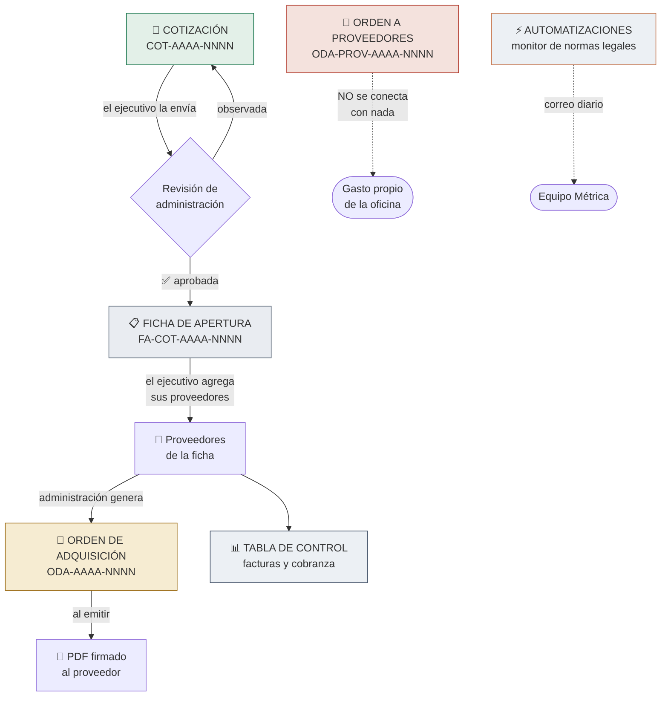
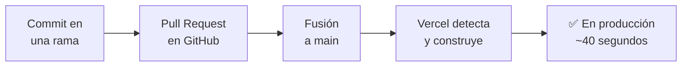

# Ficha técnica de arquitectura · Métrica Sistema Operativo

> **Documento de continuidad.** Describe el sistema **tal como está hoy en el
> código**, no como se planeó. Cada afirmación fue verificada contra el
> repositorio y contra la base de datos de producción.
>
> | | |
> |---|---|
> | Última verificación | 4 de agosto de 2026 |
> | Rama documentada | `main` · commit `7586916` |
> | Migraciones aplicadas | 37 (coinciden con los archivos del repositorio) |
>
> **Es un documento vivo.** Vive junto al código para que se actualice en el
> mismo commit que cambia lo que describe. Si algo no coincide con la realidad,
> el documento está desactualizado — no el código.
>
> **Los otros tres documentos del paquete:** `MANUAL_USUARIO.md` explica cómo se
> usa el sistema, sin tecnicismos. `INVENTARIO_COMPLETO.md` recoge lo que quedó
> a medias, la deuda técnica y los datos de prueba. `PLAN_CONTINUIDAD.md`
> responde qué hace Métrica con este sistema si quien lo construyó no está.

---

## 1. Resumen ejecutivo

Métrica Sistema Operativo es la herramienta interna con la que la agencia
gestiona su ciclo de compras: desde que se cotiza un trabajo para un cliente
hasta que se paga a los proveedores que lo ejecutan.

Antes ese recorrido vivía en hojas de cálculo y correos sueltos. El problema no
era la falta de información sino su dispersión: nadie podía responder con
certeza cuánto se le había comprometido a un proveedor, si una cotización había
sido aprobada y por quién, o qué número de orden correspondía a qué factura. El
sistema resuelve eso encadenando cuatro documentos —**cotización**, **ficha de
apertura**, **orden de adquisición** y **tabla de control**— de modo que cada
uno nace del anterior y arrastra su trazabilidad.

Lo usan tres tipos de persona. Los **ejecutivos** cotizan trabajos para sus
clientes y llenan la parte comercial de cada proceso. **Administración** revisa
y aprueba esas cotizaciones, emite las órdenes de compra a proveedores y lleva
el seguimiento de facturación y cobranza. **Gerencia** puede hacer todo lo
anterior y además gestiona los usuarios del sistema y las automatizaciones.

Hay una regla que atraviesa todo el diseño y conviene entenderla desde el
principio: **nada se borra**. Un documento equivocado se anula dejando
constancia de quién lo anuló y por qué, y su número nunca se reutiliza. Esa
decisión hace que el sistema sirva como registro auditable y no solo como
herramienta de trabajo.

Además del ciclo de compras, el sistema incorpora un espacio de
**Automatizaciones**: tareas que corren solas y avisan por correo. La primera
—y única hoy— vigila el diario oficial El Peruano y avisa cuando se publica una
norma legal que afecta a alguno de los clientes monitoreados.

---

## 2. Stack tecnológico

Versiones reales, leídas de `package.json`.

| Pieza | Versión | Qué hace y por qué está |
|---|---|---|
| **Next.js** | `16.2.9` | El marco de trabajo de toda la aplicación. Sirve las pantallas y ejecuta la lógica de negocio en el servidor mediante *Server Actions*, sin necesidad de construir un API aparte. |
| **React** | `19.2.4` | La librería sobre la que se construyen las pantallas. Viene con Next.js. |
| **TypeScript** | `^5` | JavaScript con tipos. Evita una clase entera de errores —campos mal escritos, datos con la forma equivocada— antes de que el código llegue a ejecutarse. |
| **Supabase** (`supabase-js 2.108.1`, `ssr 0.12.0`) | | Base de datos PostgreSQL, autenticación con Google y almacenamiento de archivos, todo en un mismo servicio. Es donde vive la información y donde se aplican las reglas de seguridad. |
| **Vercel** | plan **Hobby** | Donde está publicada la web. Cada cambio fusionado a `main` se despliega solo. ⚠️ Este plan **prohíbe el uso comercial** en sus términos de servicio — ver el riesgo abierto en la §8. |
| **Resend** | `^6.12.4` | Envío de los correos internos del sistema (aprobaciones, avisos). Ningún correo va a clientes. |
| **@react-pdf/renderer** | `^4.5.1` | Genera los PDF de cotizaciones y órdenes desde el servidor, con el formato de marca de Métrica. |
| **Tailwind CSS** | `^4` | El sistema de estilos de las pantallas. |
| **ESLint** | `^9` | Revisa el código en busca de errores y descuidos antes de publicar. |

**Región de despliegue:** `gru1` (São Paulo), configurada en `vercel.json`. Es
la más cercana a Perú de las disponibles.

---

## 3. Arquitectura y flujo del proceso

### El recorrido completo



### Qué es automático y qué es manual

| Paso | Cómo ocurre |
|---|---|
| Se crea la cotización | **Manual** — el ejecutivo. El código `COT` se asigna solo, del banco de códigos |
| Se envía a aprobación | **Manual** — el ejecutivo |
| Nace la ficha de apertura | **Automático** — al aprobar la cotización, en la misma operación |
| Se agregan proveedores a la ficha | **Manual** — el ejecutivo |
| Se genera la orden de adquisición | **Manual** — administración, con un botón. El código `ODA` se asigna solo |
| Se emite la orden y se crea su PDF | **Manual** — administración |
| Se llena la tabla de control | **Manual** — administración |
| Corre el monitor de normas legales | **Automático** — dos veces al día |

### Los códigos y sus relaciones

Verificadas contra las claves foráneas y los índices únicos reales:

| Relación | Cardinalidad | Cómo se garantiza |
|---|---|---|
| Cotización → Ficha de apertura | **1 : 1** | `fichas_apertura.cotizacion_id` es `unique` |
| Ficha → Proveedores de la ficha | **1 : N** | `unique (ficha_id, orden)` |
| Proveedor de ficha → Orden de adquisición | **1 : 1** | `ordenes_adquisicion.ficha_proveedor_id` es `unique` |
| Proveedor de ficha → Fila de control | **1 : 1** | `control_proceso.ficha_proveedor_id` es `unique` |
| Orden → Líneas de detalle | **1 : N** | máximo 60 líneas |
| Orden a proveedores | **suelta** | sin ninguna clave foránea hacia el resto |

El código de la ficha se deriva del de su cotización: si la cotización es
`COT-2026-0007`, su ficha es `FA-COT-2026-0007`. Eso hace que la relación sea
legible a simple vista, sin consultar el sistema.

---

## 4. Modelo de datos

26 tablas, agrupadas por módulo. **Todas tienen seguridad a nivel de fila
activada.**

### Base compartida

| Tabla | Qué guarda |
|---|---|
| `usuarios` | Quién puede entrar, con su rol y si está activo. Se llena solo al primer ingreso con Google. Lleva además tres permisos sueltos —`puede_aprobar_cotizaciones`, `puede_reactivar` y `puede_otorgar_gerencia`— y quién concedió el rol actual |
| `solicitudes_rol` | Quién pidió qué rol, quién lo resolvió y cuándo. Las resueltas se acumulan: son el historial |
| `clientes` | Empresas a las que se les cotiza: razón social, RUC, nombre comercial |
| `proveedores` | Empresas y personas a las que se les compra |

### Banco de códigos

| Tabla | Qué guarda |
|---|---|
| `banco_codigos` | Los códigos `COT` del año, pre-generados, con su estado: disponible, en uso o anulado |
| `banco_codigos_oda` | Lo mismo para los códigos `ODA` de proyectos |
| `oda_prov_correlativo` | El último número entregado de la serie `ODA-PROV`. **No es un banco**: es un contador de una fila por año |

### Fase 1 · Cotizaciones

| Tabla | Qué guarda |
|---|---|
| `cotizaciones` | La cotización: cliente, proyecto, moneda, fee, estado y su traza de aprobación o anulación |
| `cotizacion_items` | Sus líneas: proveedor, descripción, cantidad y precio. Máximo 40 |

### Fase 2 · Fichas de apertura

| Tabla | Qué guarda |
|---|---|
| `fichas_apertura` | El proceso que nace de una cotización aprobada. Apunta a su cotización (`cotizacion_id`) |
| `ficha_proveedores` | Cada proveedor dentro de la ficha, con lo que se le compra y sus datos de pago |
| `ficha_facturas_cliente` | Las facturas emitidas al cliente por ese proceso |
| `ficha_proveedor_facturas` | Las facturas que cada proveedor le emite a Métrica |

### Fase 3 · Órdenes de adquisición (proyectos)

| Tabla | Qué guarda |
|---|---|
| `ordenes_adquisicion` | La orden de compra. Apunta obligatoriamente a su ficha y al proveedor de esa ficha |
| `orden_detalles` | Sus líneas: cantidad × precio unitario. Máximo 60 |

### Fase 4 · Tabla de control

| Tabla | Qué guarda |
|---|---|
| `control_proceso` | Seguimiento administrativo por proveedor: contrato, facturas, fechas de facturación y cobro |

### Órdenes a proveedores (gasto de oficina)

| Tabla | Qué guarda |
|---|---|
| `ordenes_proveedores` | Orden suelta para gasto propio. **Sin ninguna clave foránea al resto del sistema.** Guarda también la factura que manda el proveedor (`factura_numero`, `factura_recibida_en`) con quién la cargó y cuándo |
| `orden_proveedor_detalles` | Sus líneas de compra |
| `ordenes_proveedores_borradas` | Archivo de las que se borraron: la fila completa en JSON, quién la borró y cuándo |

### Automatizaciones

| Tabla | Qué guarda |
|---|---|
| `automatizaciones` | Una fila por tarea: su interruptor, el modo prueba y el resultado de la última corrida |
| `automatizacion_ejecuciones` | El historial de cada corrida: inicio, fin, resultado y cuántas normas encontró |
| `normas_legales_cuentas` | Los clientes monitoreados (KALLPA, SPGL). `cliente_id` opcional, hoy en nulo |
| `normas_legales_terminos` | Las palabras vigiladas de cada cuenta, con sus sinónimos |
| `normas_legales_destinatarios` | A quién le llegan los avisos. Correos de texto libre, **sin relación con `usuarios`** |
| `normas_legales_hallazgos` | Las normas encontradas, con su identificador anti-duplicados |
| `normas_legales_hallazgo_cuenta` | Qué norma toca a qué cuenta y por qué términos. Es la tabla que permite que una norma se etiquete con varias cuentas |

### ⚠️ Una trampa para quien mantenga esto

Las dos tablas de órdenes tienen una columna llamada **`tipo_proveedor` con
significados incompatibles**:

- `ordenes_adquisicion.tipo_proveedor` → `empresa` o `persona_natural`
- `ordenes_proveedores.tipo_proveedor` → el rubro del gasto (6 valores)

Se conservó el nombre porque es como lo llama gerencia y lo que dice la
pantalla. Los tipos de dato son distintos, así que Postgres avisa al copiar una
consulta de un módulo al otro — pero un `::text` lo dejaría pasar en silencio
con el significado equivocado.

---

## 5. Seguridad y control de acceso

### Cómo se entra

Solo con **Google OAuth**. No hay contraseñas en el sistema.

Los dominios autorizados, según `src/config/dominios.ts`:

```
metrica.pe
metricaperu.com
```

Cualquier otro correo es rechazado en la vuelta de Google, antes de crear
sesión.

**Al primer ingreso la persona elige entre Ejecutivo y Administración, pero la
fila que se crea es siempre `ejecutivo`** (`elegirRol()` en
`src/actions/onboarding.ts`). Si pidió Administración, además se inserta una
fila en `solicitudes_rol` con estado `pendiente` y se avisa por correo a toda
la gerencia activa. Una vez registrada la persona no puede volver a elegir:
`elegirRol()` comprueba si ya existe.

Conviene subrayar por qué esto es sólido y no cosmético: **quien espera no es un
administrador con el menú escondido, su rol en la base *es* `ejecutivo`**. Todas
las barreras que ya existían para un ejecutivo —RLS, disparadores,
comprobaciones del servidor— le aplican sin que haya que escribir ninguna regla
nueva. Verificado por comportamiento: con la solicitud pendiente, un `UPDATE`
directo sobre una cotización ajena para aprobarla afecta **0 filas**; tras
aprobarle la solicitud, la misma sentencia funciona.

La solicitud la resuelve gerencia desde el módulo de Usuarios. Dos candados en
la base (migración 0033):

| Regla | Dónde vive | Qué impide |
|---|---|---|
| Solo gerencia resuelve solicitudes | `trg_solicitud_no_propia()` + política `solicitudes_resolver` | Que un ejecutivo o administración se conceda el rol |
| Nadie resuelve la suya | `trg_solicitud_no_propia()` | Que una gerencia con solicitud propia se la apruebe |

**El rol de Gerencia es aparte.** No lo concede cualquier gerencia, sino solo
quien tenga la columna `usuarios.puede_otorgar_gerencia`. Es un dato, no una
regla escrita en código: se transfiere desde la pantalla de Usuarios sin tocar
nada. La migración 0035 añadió que **nadie lo cambia sobre su propia fila** —si
la única persona que lo tiene se lo quitara, el permiso desaparecería del
sistema y solo volvería con otra migración.

Las tres decisiones —conceder el rol, rechazarlo, mover el permiso— quedan con
autor y fecha: `solicitudes_rol.resuelta_por/resuelta_en` y
`usuarios.rol_otorgado_por/rol_otorgado_en`. Las solicitudes resueltas no se
borran (`trg_no_borrar`): son el historial de quién pidió qué y quién decidió.

Un usuario dado de baja **a mitad de sesión** también queda fuera: su login de
Google sigue vivo, pero su fila en `usuarios` deja de responder y el sistema lo
trata como si no existiera.

### Qué es RLS y por qué importa

*Row Level Security* es una función de PostgreSQL que decide, **fila por fila**,
qué puede ver y modificar cada usuario. La diferencia con una validación normal
es dónde vive la regla.

Si la restricción está solo en la pantalla, basta con que alguien llame al
servidor por fuera de la aplicación para saltársela. Con RLS, la regla vive
**dentro de la base de datos**: da igual desde dónde llegue la petición —la
pantalla, un script, una herramienta externa— porque la base devuelve
únicamente lo que a esa persona le corresponde.

En este sistema RLS es la barrera real. Las comprobaciones en el servidor
existen para dar mensajes claros; las de la base son las que de verdad impiden.

### Los tres roles

Verificado contra las **73 políticas RLS** reales.

| | Ejecutivo | Administración | Gerencia |
|---|---|---|---|
| Ver el banco de códigos | ✅ | ✅ | ✅ |
| Crear y editar **sus** cotizaciones | ✅ | ✅ | ✅ |
| Ver cotizaciones **ajenas** | ❌ | ✅ | ✅ |
| Anular cotizaciones | ❌ | ✅ | ✅ |
| **Aprobar u observar cotizaciones** | ❌ | solo con `puede_aprobar_cotizaciones` | ✅ |
| Ver y editar fichas de apertura | solo las suyas | ✅ | ✅ |
| Órdenes de adquisición | ❌ | ✅ | ✅ |
| Órdenes a proveedores | ❌ | ✅ | ✅ |
| Tabla de control | ❌ | ✅ | ✅ |
| Ver el estado e historial de automatizaciones | ✅ | ✅ | ✅ |
| Administrar automatizaciones | ❌ | ❌ | ✅ |
| Gestionar usuarios y roles | ❌ | ❌ | ✅ |
| Ver solicitudes de rol | solo la suya | solo la suya | ✅ |
| Resolver solicitudes de rol | ❌ | ❌ | ✅ salvo la propia |
| Otorgar el rol de Gerencia | ❌ | ❌ | solo con `puede_otorgar_gerencia` |
| Decidir quién aprueba cotizaciones | ❌ | ❌ | ✅ salvo su propia fila |

Todas las políticas se apoyan en dos funciones: `fn_mi_id()` y `fn_mi_rol()`,
que leen el correo del token de sesión y devuelven la identidad y el rol
**solo si el usuario está activo**.

### Mecanismos especiales

#### El banco de códigos atómico

**El problema que resuelve:** dos personas creando una cotización al mismo
tiempo podrían llevarse el mismo número, o uno podría "perderse" si algo falla a
medias. Dos documentos con el mismo código es un problema de auditoría que no
tiene arreglo después.

**Cómo lo resuelve:** el código no se elige, se pide. La función
`crear_cotizacion()` toma un candado por año, agarra el siguiente código
disponible, lo marca como usado y crea la cotización — **todo en una sola
operación indivisible**. Si algo falla en cualquier punto, se revierte entero y
el código queda libre. Si dos personas pulsan a la vez, la segunda espera a que
la primera termine y recibe el número siguiente.

*«Atómico»* significa exactamente eso: o pasa todo, o no pasa nada. Nunca queda
a medias.

Existen tres series independientes, cada una con su propio mecanismo:
`crear_cotizacion()` para `COT`, `generar_oda()` para `ODA`, y
`crear_orden_proveedor()` para `ODA-PROV`.

#### La anulación en cascada

Cuando un proceso se cae entero, `anular_proceso()` anula en bloque la
cotización, su código, la ficha, todas las órdenes del proceso y sus códigos —
en una sola operación. Garantiza que no quede un estado intermedio absurdo: una
ficha anulada con órdenes vigentes colgando, por ejemplo.

#### La reactivación de un proceso anulado

`reactivar_proceso()` revierte la cascada completa: devuelve la cotización, la
ficha y las órdenes al estado exacto que tenían antes de anularse. Es el único
camino de vuelta desde `anulada`, que en todo lo demás es un estado final.

**Quién puede usarla.** Cualquiera con rol **gerencia**, o cualquier usuario a
quien gerencia le haya activado el permiso **`puede_reactivar`** desde el módulo
de Usuarios. Es una columna real de la tabla `usuarios`, agregada por la
migración `0017`, con valor `false` por omisión.

> Antes de la `0017` la autorización estaba escrita a mano en la función: rol
> gerencia **o el correo `erika.pomacaja@metrica.pe`**. Esa migración lo
> reemplazó por el permiso configurable. Verificado en la función viva: el correo
> personal ya no aparece.

**Hoy, en producción,** ningún usuario tiene el permiso activado, así que solo
gerencia puede reactivar.

**Cómo recupera el estado anterior.** No adivina. Al anular, la cascada guarda el
estado que cada documento tenía en una columna `estado_previo_anulacion`; al
reactivar, lee esa columna y lo restaura. Si por alguna razón está vacía, cae a
un valor razonable (`aprobada` para la cotización, `completa` para la ficha).

Solo restaura las órdenes que **esa misma cascada** anuló — las reconoce porque
son las que tienen `estado_previo_anulacion` guardado. Una orden que ya estaba
anulada antes, por su cuenta, se queda anulada.

**⚠️ Qué pasa con los códigos: la excepción al candado.** Los códigos vuelven a
`en_uso`. El trigger `trg_codigo_anulado_es_final`, que normalmente impide que un
código anulado cambie de estado, tiene una salida deliberada:

```sql
and coalesce(current_setting('app.reactivando', true), '') <> 'on'
```

`reactivar_proceso()` enciende esa marca **solo durante su propia transacción**.
Al terminar, el candado vuelve a estar cerrado para todos.

Es una excepción real y por eso está documentada como tal, igual que la del
borrado de ODA-PROV en borrador. Pero conviene entender su alcance exacto: el
código vuelve **al mismo documento que lo tenía**. En ningún momento un código
queda libre para que otro documento lo tome. Lo que se revierte es la anulación
completa de un proceso —como si nunca hubiera ocurrido— no el reciclaje de un
número.

#### Los códigos no se reciclan

**Ningún código se le entrega jamás a un documento distinto.** Un código tomado
no vuelve al banco para que otro lo use. Está garantizado por tres vías: no hay
código en la aplicación que lo haga, ninguna función SQL lo hace, y
`banco_codigos` **no tiene política de UPDATE** — un intento directo modifica 0
filas.

**La única excepción, y es controlada:** `reactivar_proceso()` devuelve un código
del estado `anulado` a `en_uso`. Pero se lo devuelve **al mismo documento que
siempre lo tuvo**, no a uno nuevo. La regla que importa —que dos documentos
distintos nunca lleven el mismo número— se mantiene intacta. Ver el detalle
abajo.

#### Aprobar es un permiso, no el rol

Desde la migración `0037`, tener rol de Administración **no implica** poder
aprobar. El rol da acceso a las órdenes, la tabla de control y la información
comercial; aprobar u observar una cotización —que es comprometer plata— lo
concede gerencia persona por persona, en la columna
`usuarios.puede_aprobar_cotizaciones`.

Gerencia siempre puede, sin necesitar la columna: la comprobación es
`rol = 'gerencia' or puede_aprobar_cotizaciones`, el mismo criterio que
`puede_reactivar`.

Observar exige el mismo permiso que aprobar, porque es la otra mitad de la misma
decisión: sin eso, quien no puede aprobar podría bloquear el proceso devolviendo
todo lo que no le conviniera. **Anular sí queda con el rol**: es un acto
administrativo con motivo obligatorio y traza, no una decisión de gasto.

La barrera real está en `trg_cotizacion_transicion`. En la pantalla, además, a
quien no tiene el permiso **se le esconde la sección Aprobaciones y deja de
recibir el correo** de cotización pendiente — un aviso sin botón es ruido.

#### El candado de no-autoaprobación

**Sí existe, y desde agosto de 2026 no tiene excepciones.** Nadie aprueba su
propia cotización, gerencia incluida.

Vive en tres capas: la máquina de estados de la base
(`trg_cotizacion_transicion`), la validación del servidor (`aprobaciones.ts`) y
la cola de la interfaz, que salta las propias para que no traben el trabajo.

#### Nada se borra

Las tablas de documentos con valor contable llevan `trg_no_borrar`: un intento
de borrado lanza un error, incluso con la llave privilegiada. La única excepción
son las órdenes a proveedores **en estado borrador** — y aun así quedan
archivadas en `ordenes_proveedores_borradas` por un trigger `BEFORE DELETE`, con
la fila completa y quién la borró.

#### Funciones con privilegios

Las **15 funciones `SECURITY DEFINER`** del sistema tienen `SET search_path =
public`. Sin eso, alguien podría colar un objeto con el mismo nombre en otro
esquema y hacer que la función ejecute algo distinto de lo que debería.

---

## 6. Almacenamiento y respaldo de datos

### Dónde viven los datos

Todo en **Supabase** (proyecto `metrica-login`, región `sa-east-1`, PostgreSQL
17), en plan **Pro**.

### Los archivos PDF

Tres *buckets* de almacenamiento, **los tres privados**:

| Bucket | Qué guarda |
|---|---|
| `cotizaciones` | PDF de las cotizaciones aprobadas |
| `fichas` | PDF de las fichas de apertura |
| `ordenes` | PDF de las órdenes emitidas, de proyectos y de proveedores |

Que sean privados significa que no hay URL pública: un PDF solo se descarga a
través del sistema, que verifica la sesión antes de entregarlo. El archivo se
transmite desde el servidor en lugar de redirigir a un enlace firmado, porque
los PDF de órdenes llevan **datos bancarios del proveedor** y ese enlace no debe
quedar registrado en el navegador ni en intermediarios.

### Respaldos

El plan Pro de Supabase incluye **copias de seguridad diarias automáticas**.
La recuperación a un punto en el tiempo (*Point-in-Time Recovery*) es un
complemento que se contrata aparte.

> **Pendiente de confirmar:** si el complemento de PITR está contratado. Se
> verifica en el panel de Supabase, en Database → Backups.

Además de las copias de Supabase, el esquema completo está versionado en este
repositorio: las **32 migraciones** de `supabase/migrations/` permiten
reconstruir la estructura de la base desde cero. No contienen los datos, pero sí
la definición íntegra de tablas, reglas y permisos.

### Si Supabase se cae

Mientras dure la caída el sistema no funciona: la base, la autenticación y los
archivos están todos ahí. No hay un modo degradado.

Lo que sí está protegido es la **pérdida** de información: los respaldos diarios
la acotan, y el esquema vive en el repositorio. Un incidente de Supabase es un
problema de disponibilidad, no de integridad.

### Cómo exportar los datos

Sin quedar atado a la herramienta:

1. **Base completa** — Supabase es PostgreSQL estándar. `pg_dump` produce un
   archivo que cualquier otro PostgreSQL puede leer, y hay proveedores
   alternativos que lo importan directo.
2. **Tabla por tabla** — el panel de Supabase exporta cualquier tabla a CSV, que
   abre en Excel.
3. **Los PDF** — se descargan del almacenamiento con la API de Supabase o desde
   su panel.

No hay formatos propietarios en ninguna capa.

---

## 7. Infraestructura y despliegue

### Dónde está publicado

**Vercel**, plan **Hobby**, proyecto `metrica-sistema`, región `gru1`.

> ⚠️ El plan Hobby no permite uso comercial según los términos de servicio de
> Vercel. El sistema funciona sin problemas técnicos en él, pero hay un riesgo
> de cumplimiento abierto y una migración pendiente de aprobación. Ver §8.

### Cómo se despliega un cambio



**La rama de producción es `main`.** Es la única que Vercel despliega. Apuntarla
a otra rama rompe el despliegue en silencio — ya ocurrió, y está documentado en
`AGENTS.md`.

> ⚠️ **La rama por defecto del repositorio NO es `main`**, sino
> `claude/pensive-franklin-dbrg7b` (verificado el 4 de agosto de 2026 contra el
> API de GitHub). Las tareas programadas de GitHub corren desde la rama por
> defecto, no desde `main`. Hoy no rompe nada porque el archivo del workflow es
> idéntico en ambas, pero es una desincronización latente del mismo tipo que la
> de Vercel. Ver `INVENTARIO_COMPLETO.md`.

> ⚠️ **El repositorio es público.** No contiene credenciales —`.gitignore` cubre
> `.env*`, no hay archivos de entorno versionados y solo aparecen *nombres* de
> variables— pero sí el código completo, las migraciones, el RUC de Métrica y
> los nombres de los clientes.

### Las migraciones de base de datos

No se despliegan con el código: se aplican a Supabase por separado. La regla del
proyecto, escrita en `AGENTS.md`, es que **el archivo de la migración se fusiona
a `main` antes o junto con aplicarla**, nunca después. Si no, los archivos dejan
de reflejar la base y pierden su utilidad para reconstruirla.

### Variables de entorno

Solo los nombres. **Los valores no se documentan en ningún archivo del
repositorio.**

| Variable | Para qué |
|---|---|
| `NEXT_PUBLIC_SUPABASE_URL` | Dirección del proyecto Supabase |
| `NEXT_PUBLIC_SUPABASE_ANON_KEY` | Llave pública de Supabase. Viaja al navegador; es segura porque RLS decide qué puede ver cada quien |
| `SUPABASE_SERVICE_ROLE_KEY` | 🔒 Llave privilegiada. **Salta RLS por completo.** Solo servidor, nunca al navegador |
| `RESEND_API_KEY` | 🔒 Llave para enviar correos |
| `CORREO_REMITENTE` | Desde qué dirección salen los correos |
| `CORREO_PRUEBAS` | Redirige **todos** los correos a una dirección, para probar sin molestar a nadie |
| `URL_SISTEMA` | Dirección pública del sistema. Se usa en los enlaces y el logo de los correos |
| `CRON_SECRET` | 🔒 Contraseña compartida entre GitHub Actions y el sistema, para que solo la tarea programada pueda disparar el monitor |

Se configuran en el panel de Vercel. `CRON_SECRET` y `URL_SISTEMA` deben estar
además en los secretos del repositorio de GitHub.

### La tarea programada

`.github/workflows/normas-legales.yml` corre a las **13:00 y 23:00 UTC** (8:00 y
18:00 en Lima). Solo dispara: hace una petición al sistema con el secreto
compartido y termina. Todo el trabajo ocurre en Vercel, porque es desde ahí
donde se verificó que El Peruano responde.

Se eligió GitHub Actions en vez de Vercel Cron porque el plan Hobby no permite
dos corridas diarias. Al migrar a Pro esa restricción desaparece, pero no haría
falta cambiar nada: GitHub Actions es independiente del plan de Vercel.

> 🔴 **La tarea se dispara pero no ejecuta nada.** El intermediario de sesión
> (`src/proxy.ts`) intercepta todas las rutas salvo `/login`, `/acceso-denegado`
> y `/auth`. La petición del cron no trae cookie de sesión, así que la desvía a
> `/login` con un 307 — y `curl --fail-with-body` no considera fallo un 3xx, de
> modo que el paso sale verde. Diez disparos programados desde el 31 de julio,
> cero corridas registradas. Diagnóstico completo y corrección en
> `INVENTARIO_COMPLETO.md`.

### Servicios externos

| Servicio | Para qué | Si se cae |
|---|---|---|
| **Supabase** | Base de datos, login y archivos | El sistema no funciona |
| **Vercel** | Publicación de la web | El sistema no es accesible |
| **Resend** | Correos internos | Todo funciona, pero no llegan avisos |
| **Google OAuth** | Inicio de sesión | Nadie puede entrar; las sesiones abiertas siguen |
| **El Peruano** | Fuente del monitor de normas | Solo afecta a esa automatización, que lo registra como error |

---

## 8. Propiedad y continuidad

El detalle de qué cuentas existen, a nombre de quién están y cómo se transfiere
el acceso vive en un documento aparte, **`PLAN_CONTINUIDAD.md`**. Aquí solo se
deja constancia de que existe y de la distinción que importa: las cuentas de
**Supabase, Vercel, GitHub y Resend** son las que sostienen el sistema, y si
alguna está a nombre personal de un colaborador en lugar de a nombre de la
empresa, eso es un riesgo de continuidad que el otro documento debe resolver.

Este documento no repite ese detalle a propósito: mezclarlo aquí lo dejaría
desactualizado en cuanto cambie una titularidad.

### 🔶 Riesgo abierto · El plan de Vercel prohíbe el uso comercial

**Esto no es un problema técnico ni de capacidad.** El sistema funciona
perfectamente en el plan actual y no se acerca a ninguno de sus límites. Es un
asunto de **términos de servicio**, y por eso aparece en esta sección y no en la
de infraestructura.

**La situación.** El sistema opera hoy sobre el plan **Hobby** de Vercel, cuyos
términos de servicio están reservados para proyectos personales y no comerciales.
Este es el sistema operativo interno de una empresa, de modo que el uso que se le
da no corresponde al plan contratado.

**La consecuencia si no se resuelve.** Vercel puede suspender el proyecto, y su
política no obliga a un aviso previo. Si eso ocurre, **el sistema deja de estar
accesible para todo el equipo de un momento a otro**. No hay modo degradado ni
alternativa de acceso: la web simplemente no responde.

Conviene ser preciso sobre el alcance: **no se perderían datos**. La información
vive en Supabase, que es un servicio distinto y está en un plan de pago
apropiado. Sería una interrupción de servicio, no una pérdida de información.

**La resolución.** Migrar a **Vercel Pro**, US$ 20 al mes por asiento de
desarrollador. Un dato que suele confundir y conviene dejar escrito: **los
usuarios del sistema no cuentan como asientos**. Los asientos son de quien
desarrolla y administra el proyecto en Vercel, no de quien usa la aplicación
publicada. Con un asiento basta.

**Estado:** el gasto está en aprobación por administración.

**Por qué no habrá cargos sorpresa.** El consumo real medido a 30 días está entre
el **0,1 % y el 3 %** de los límites del plan más pequeño. La migración a Pro
trae la suscripción base y nada más; el sistema no genera tráfico ni cómputo
cerca de donde empiezan los cobros por uso.

**Alternativa evaluada.** Si el costo fuera un impedimento, **Render** (~US$ 7 al
mes) permite uso comercial y soporta una aplicación Next.js. Implicaría rehacer
la configuración de despliegue y las variables de entorno; el código no
cambiaría. Se deja anotada como camino viable, no como recomendación: Vercel Pro
es continuidad sin trabajo adicional.

---

## 9. Glosario

| Término | Qué significa |
|---|---|
| **COT** | Cotización. Código `COT-AAAA-NNNN` |
| **FA** | Ficha de Apertura. Código `FA-COT-AAAA-NNNN`, derivado del de su cotización |
| **ODA** | Orden de Adquisición: la orden de compra que se le emite a un proveedor |
| **ODA-PROV** | Orden a proveedores para gasto propio de la oficina. Serie aparte, sin conexión con proyectos |
| **RLS** | *Row Level Security*. Reglas dentro de PostgreSQL que deciden fila por fila qué ve cada usuario. La restricción vive en la base, no en la pantalla |
| **RUC** | Registro Único de Contribuyentes: el identificador tributario de una empresa o persona en Perú |
| **IGV** | Impuesto General a las Ventas (18%). Lo lleva una factura; un recibo por honorarios no |
| **RxH** | Recibo por Honorarios: el comprobante que emite una persona natural independiente |
| **Retención de 4ta** | Descuento de impuesto a la renta que se aplica sobre un RxH, salvo constancia de suspensión |
| **Detracción** | Parte del pago que se deposita en una cuenta del Banco de la Nación del proveedor, en lugar de pagársela directamente |
| **Banco de códigos** | Los números de documento pre-generados por año. Se toman en orden y no se reciclan |
| **Correlativo** | La numeración consecutiva de una serie de documentos |
| **Atómico** | Una operación que ocurre entera o no ocurre. Nunca queda a medias |
| **Server Action** | Función de Next.js que se escribe junto a la pantalla pero se ejecuta en el servidor. Así la lógica sensible nunca llega al navegador |
| **Migración** | Archivo `.sql` que describe un cambio en la estructura de la base. En conjunto permiten reconstruirla desde cero |
| **Bucket** | Carpeta de almacenamiento de archivos en Supabase. Los de este sistema son privados |
| **Trigger** | Regla de PostgreSQL que se dispara sola al insertar, actualizar o borrar una fila |
| **SECURITY DEFINER** | Función que corre con los privilegios de su dueño, no de quien la llama. Permite operaciones que el usuario no podría hacer directamente |
| **`puede_reactivar`** | Permiso por usuario, en la tabla `usuarios`, que gerencia activa para dejar que alguien revierta la anulación de un proceso |
| **Anulación en cascada** | Anular de una sola vez la cotización, la ficha, sus órdenes y todos sus códigos, en una operación que no puede quedar a medias |

---

## 10. Diferencias encontradas vs. lo planeado

Auditoría del 3 de agosto de 2026, revisada el 4. **Siete diferencias resueltas y
verificadas**, más **cuatro temas abiertos**. Las resueltas se dejan documentadas
porque el historial de qué falló y cómo se corrigió es parte de la continuidad —
quien mantenga esto va a querer saber por qué existen las migraciones `0029` a la
`0036`.

> El inventario completo de deuda técnica, datos de prueba y piezas
> desconectadas vive en **`docs/INVENTARIO_COMPLETO.md`**. Esta sección se limita
> a las diferencias entre lo planeado y lo construido.

### 🔴 1 · Una tabla sin protección — RESUELTO

**Qué se encontró.** `oda_prov_correlativo` no tenía RLS activado. Era la única
de las 26 tablas así. Cualquiera con la llave pública —que viaja en el navegador
y por lo tanto es visible— podía leerla y **escribirla**.

**Por qué importaba.** Esa tabla guarda el último número de orden entregado.
Bajarlo habría hecho que la siguiente orden reutilizara un número ya usado: dos
documentos distintos con el mismo código, justo lo que toda la numeración existe
para evitar.

**Cómo se resolvió.** Migración `0029`. Se replicó el patrón de los otros dos
bancos: RLS activo, una política y solo de SELECT, **cero de escritura**. Mover
el contador es exclusivo de `crear_orden_proveedor()`.

**Verificado.** Un ejecutivo ve 0 filas; gerencia intentando escribir modifica 0
filas; la función legítima sigue operando.

### 🔴 2 · Código roto en producción — RESUELTO

**Qué se encontró.** `ordenes-proveedores.ts` consultaba
`banco_codigos_oda_prov`, una tabla eliminada por la migración `0028`. **Anular
una ODA de proveedores fallaba en producción.**

**Cómo se resolvió.** Se corrigió la referencia y se fusionó a `main` (PR #5).

### 🟡 3 · La base iba por delante del código — RESUELTO

**Qué se encontró.** Cuatro migraciones aplicadas en Supabase cuyos archivos
vivían en una rama sin fusionar. Tres realidades conviviendo: Supabase con 31,
`main` con 27, y la rama que Vercel desplegaba con 27 y un commit propio.

**Causa raíz.** La rama de producción de Vercel no era `main` sino una rama de
trabajo. Fusionar a `main` no desplegaba nada.

**Cómo se resolvió.** Se fusionó todo a `main` (PR #4 y #5), se cambió la rama
de producción de Vercel a `main`, y **la regla quedó escrita en `AGENTS.md`**
con el relato de por qué, para que no se repita.

**Verificado.** 32 archivos de migración en `main` = 32 aplicadas en Supabase.

### 🟡 4 · Gerencia podía aprobar sus propias cotizaciones — RESUELTO

**Qué se encontró.** El candado de no-autoaprobación excluía explícitamente a
gerencia, en las tres capas.

**Cómo se resolvió.** La dueña del proceso confirmó que el control no admite
excepciones por rango. Migración `0030` más los cambios de servidor e interfaz.

**Verificado.** Gerencia no puede aprobar la suya; no le traba la cola; otra
cuenta de administración sí puede aprobarla.

### 🟡 5 · Se podía borrar una orden emitida sin dejar rastro — RESUELTO

**Qué se encontró.** La migración `0028` quitó `trg_no_borrar` de
`ordenes_proveedores` para habilitar el botón de Borrar que se pidió, y al
hacerlo abrió un hueco no previsto: se podía borrar una orden **en cualquier
estado, incluso emitida con su PDF ya enviado**, sin que quedara nada.

**Cómo se resolvió.** Dos migraciones. La `0031` archiva toda orden antes de
borrarla, con un trigger `BEFORE DELETE` que se dispara venga el borrado de
donde venga. La `0032` restringe el borrado a estado `borrador`: una orden
emitida solo se puede anular.

**Verificado.** Borrar una emitida falla con un mensaje que sugiere Anular;
borrar un borrador funciona y queda archivado con autor y fecha.

### Cierres adicionales de la misma auditoría

| | |
|---|---|
| **Destinatarios del monitor** | Antes el sistema aceptaba cualquier correo y la garantía era la disciplina. Ahora un `CHECK` en la base impide agregar uno fuera de los dominios de Métrica |
| **Correo fijo en el código** | `normas-monitor.ts` tenía un correo personal escrito. Ahora el modo prueba manda a quien pulsa el botón, o a los usuarios con rol gerencia si la dispara la tarea programada |

### 🟡 6 · Cualquiera podía autoasignarse rol Administración — RESUELTO

**Qué se encontró.** En la Fase 1 se decidió que un usuario nuevo se creara con
rol Ejecutivo y que gerencia lo ajustara después. **El código no hacía eso:**
`elegirRol()` en `src/actions/onboarding.ts` aceptaba `'admin' | 'ejecutivo'` y
registraba a la persona con el rol que ella misma eligiera en la pantalla
`/elegir-rol`.

**Por qué importaba.** El rol Administración da permiso para **aprobar
cotizaciones**, emitir órdenes de compra y ver toda la información comercial.
Cualquier persona con un correo de los dominios permitidos podía tomarlo en su
primer ingreso, sin que nadie lo autorizara.

Conviene medir bien el riesgo, sin exagerarlo ni minimizarlo. El acceso está
limitado a correos `@metrica.pe` y `@metricaperu.com`, así que no es una puerta
abierta a un extraño: hace falta ser de la casa. Pero sí significa que **un
colaborador nuevo obtiene permisos de aprobación sin pasar por ninguna
autorización**, y eso deja cojo el control de cuatro ojos que se blindó en la
migración `0030`: ese candado impide aprobar *lo propio*, pero no impide que
alguien se dé a sí mismo el rol para aprobar *lo de los demás*.

**Cómo se cerró** (migraciones `0033` y `0035`, detalle en la §5):

- `elegirRol()` registra **siempre** con rol `ejecutivo`. Si la persona pidió
  Administración, se abre una fila en `solicitudes_rol` y se avisa por correo a
  la gerencia activa.
- Quien espera **es** un ejecutivo en la base, no un administrador con el menú
  oculto: hereda todas las barreras que ya existían, sin reglas nuevas.
- `trg_solicitud_no_propia()` impide que alguien resuelva su propia solicitud,
  gerencia incluida.
- El rol de Gerencia se separó en un permiso aparte,
  `usuarios.puede_otorgar_gerencia`, que es un **dato** y no un correo escrito
  dentro de una función — el error que la `0013` cometió y la `0017` tuvo que
  reparar. La `0035` añadió que nadie lo cambia sobre su propia fila, para que
  el permiso no pueda desaparecer del sistema.

**Verificación por comportamiento**, no por lectura de código. Con sesiones
simuladas: un ejecutivo con solicitud pendiente no ve ni una cotización y su
`UPDATE` de aprobación afecta 0 filas; aprobada la solicitud, la misma sentencia
funciona; una gerencia sin el permiso no consigue crear otra gerencia ni
autoconcederse el permiso, y sí puede seguir cambiando el resto de roles.

### 🔴 7 · El monitor de normas se dispara pero no corre — ABIERTO

**Qué se encontró (4 de agosto).** La tarea programada de GitHub se ejecutó diez
veces desde el 31 de julio, siempre con conclusión `success`. En la base, la
última corrida registrada es del **30 de julio**, y fue manual.

**La causa.** `src/proxy.ts` protege todas las rutas salvo `/login`,
`/acceso-denegado` y `/auth`. La petición del cron no lleva cookie de sesión, así
que el intermediario responde un **307 hacia `/login`** antes de que el endpoint
—que sí tiene su propia autorización por `CRON_SECRET`, bien implementada— llegue
a ejecutarse. El log de la Action lo muestra literalmente: la respuesta es
`Redirecting...`. Y `curl --fail-with-body` solo falla con 400 o más, de modo que
un 307 pasa por bueno.

**Por qué importa.** El aviso de normas legales lleva cinco días sin salir y el
tablero dice que todo está bien. Un monitor que falla en silencio es peor que no
tenerlo: se confía en él.

**La corrección.** Agregar `/api/automatizaciones/normas-legales` a
`RUTAS_PUBLICAS` en `src/proxy.ts`. No debilita nada: la autorización real vive
en el endpoint. Conviene además que la Action use `--location-trusted` o
verifique el código HTTP, para que un desvío futuro no vuelva a pasar por éxito.

**Estado:** documentado, sin corregir — la dueña del proceso pidió dejarlo
anotado en esta ronda.

### 🔴 11 · La pantalla de solicitudes nunca llegó a mostrarse — RESUELTO

**Qué se encontró (4 de agosto, reportado por gerencia).** La primera persona que
usó el flujo nuevo pidió Administración y su solicitud quedó pendiente. En la
pantalla de Usuarios **no aparecía por ningún lado**, así que no había forma de
aprobarla.

**La causa.** `solicitudes_rol` apunta **dos veces** a `usuarios` —`usuario_id` y
`resuelta_por`—. Las dos consultas nuevas pedían `usuarios(nombre, correo)` sin
decir por cuál de las dos claves unir, y PostgREST rechaza la consulta entera.
Como ninguno de los dos sitios comprobaba `error`, el resultado era una lista
vacía indistinguible de "no hay nada pendiente". El botón Aprobar tampoco habría
funcionado: la misma ambigüedad estaba en `resolverSolicitud()`.

Las otras doce consultas del sistema que embeben `usuarios` **sí** desambiguan
(`usuarios!cotizaciones_ejecutivo_id_fkey`). Estas dos fueron las únicas que no.

**El daño colateral.** Al no poder aprobar, gerencia cambió el rol a mano desde
el selector de la tabla. El rol cambió pero la solicitud siguió `pendiente`, y
como la franja de aviso mira la solicitud y no el rol, la persona —ya
administradora— seguía leyendo *«tu solicitud está pendiente, mientras tanto
trabajas como Ejecutivo»* en todas las pantallas.

**Cómo se cerró.**

- Las dos consultas nombran la clave foránea, y ahora **comprueban `error`**: si
  falla, la pantalla lo dice en rojo en vez de fingir que no hay solicitudes.
- **Migración `0036`** · un disparador cierra la solicitud pendiente en la misma
  operación en que cambia el rol —`aprobada` si coincide con lo pedido,
  `rechazada` si no—, con autor y fecha. El rol y la solicitud ya no pueden
  divergir.
- `cambiarRol()` manda el mismo correo que el botón Aprobar: para quien espera,
  las dos cosas son el mismo hecho.
- La franja de aviso no se dibuja si la persona ya tiene el rol que pidió.

**La lección, porque es la parte útil.** Esta función se dio por verificada con
pruebas de comportamiento sobre la base, con sesiones simuladas. Eran correctas y
no sirvieron: **el fallo estaba en la capa que traduce la consulta, no en las
reglas de la base.** Una barrera bien puesta no dice nada sobre si la pantalla
llega a consultarla.

### 🔶 8 · El plan de Vercel no permite uso comercial — ABIERTO

Detallado en la §8. Se lista aquí para que aparezca en el inventario de temas
pendientes: no es un defecto del sistema sino un riesgo de cumplimiento, con la
migración a Vercel Pro en aprobación por administración.

### 🔶 9 · La rama por defecto de GitHub no es `main` — ABIERTO

`claude/pensive-franklin-dbrg7b` es hoy la rama por defecto del repositorio. Las
tareas programadas corren desde ahí, no desde `main`. Se corrige en Settings →
General → Default branch. Ver §7.

### 🔶 10 · El repositorio es público — ABIERTO

No hay credenciales dentro, pero sí el código, las migraciones, el RUC de la
empresa y los nombres de los clientes. Ver §7.

### Deuda menor, sin resolver

**`trg_codigo_anulado_es_final` no tiene `SET search_path`.** Es la única función
del sistema sin él y el linter de Supabase la marca. El riesgo es bajo porque es
`SECURITY INVOKER`: corre con los privilegios de quien la llama, sin elevación.
Se deja anotada para una limpieza futura.

### Observaciones que no son defectos

Se detectaron y se dejan constancia por si alguien las encuentra y se pregunta:

- **`ordenes_adquisicion.cuenta_cci`** quedó sin uso desde la migración `0012`,
  que la partió en `cuenta` y `cci`. Sobrevive por los registros antiguos.
- **`tomar_codigo()` y `tomar_codigo_oda()`** siguen existiendo pero tienen su
  ejecución revocada desde la `0021`. Quedaron obsoletas al mover la asignación
  de correlativos dentro de las funciones de creación.
- **`ordenes_proveedores.descripcion`** existe pero no se usa: el detalle vive
  en las líneas.
- En `clientes` hay dos registros que parecen el mismo con distinta grafía
  (**"CENTENARIO"** y **"CENTERNARIO"**). No se tocó: revisar dependencias antes
  de unificarlos.
